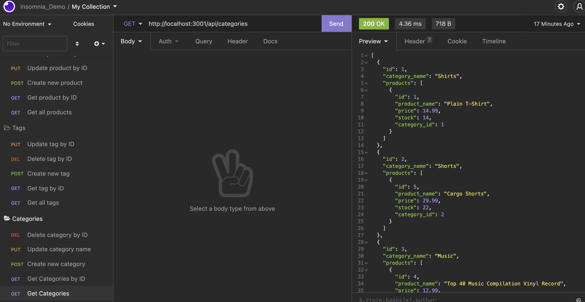
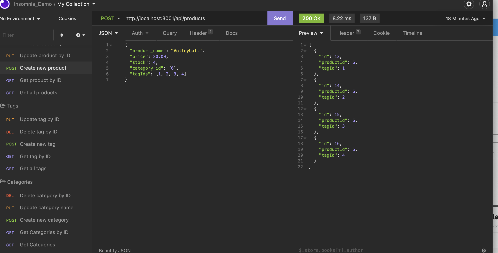
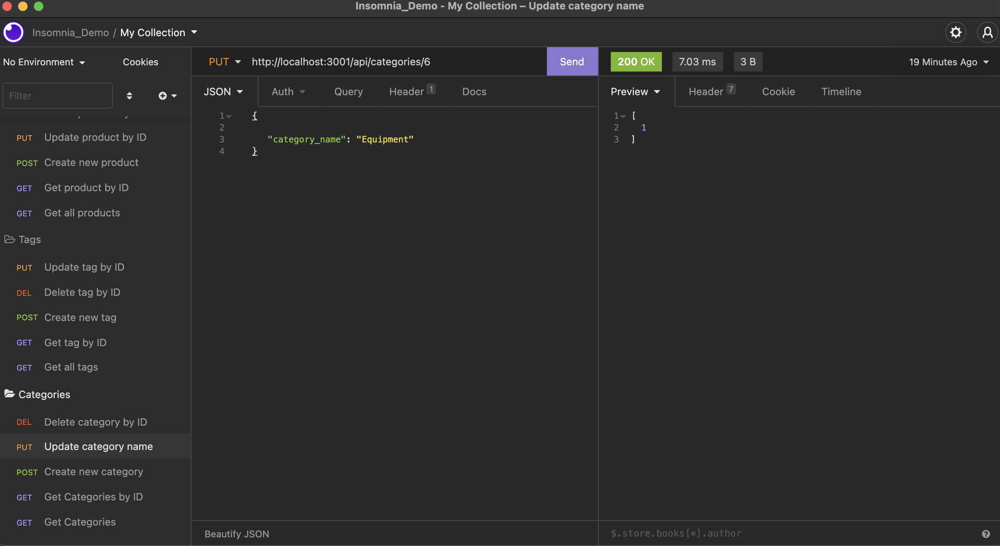
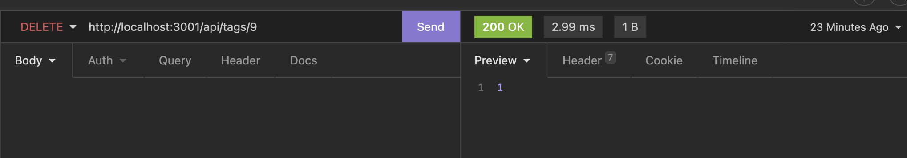

# ECommerce


## Description
This application demonstrates the use of a backend system to support an e-commerce site.  

Highlights for this project:
- Express.js APIs to use Sequelize to interact with a MySQL database
- GET, POST, PUT, DELETE API actions to maintain database
- Association methods on the Sequelize models in order to create relationships

## Table of Contents
- [User Story](#user-story)
- [Installation](#installation)
- [Usage](#usage)
- [License](#license)
- [Contributing](#contributing)
- [Tests](#tests)
- [Demo](#demo)
- [Questions](#questions)

## User Story

```md
AS A manager at an internet retail company
I WANT a back end for my e-commerce website that uses the latest technologies
SO THAT my company can compete with other e-commerce companies
```
## Installation
To download this code and modify it, make sure you install the following:
- Node.js
- MySql
- Insomnia or Postman for testing APIs
- NPM package dependencies ('NPM install') including:
    - express
    - dotenv
    - mysql2
    - sequelize

Ensure that you update the .env environment with your database credentials.

## Usage

Use the schema.sql file in the db folder to create your database with MySQL shell commands. Use environment variables to store sensitive data like your MySQL username, password, and database name.  Then, exit the MySQL shell and seed the database by using the command 'npm run seed' so that you can test your routes.

Open Insomnia or a similar application and test the various API calls for each data set, including GET, POST, PUT, and DELETE.

Example of GET method that returns all results from the database.


Example of POST method to create new data.


Example of PUT method to change data.


Example of DELETE method to delete data.


## License
This application is covered under the [License: MIT](https://opensource.org/licenses/MIT).


## Contributing
Resources from this project:
- Node.js
- Express.js
- Insomnia
- MySql


## Tests
Use an application such as Insomnia to test API calls for modifying your database.

## Demo
[Demo](https://watch.screencastify.com/v/juUU658K9TL5qYF6QfpL)


## Questions
Contact Details:

- GitHub profile: [mel-ificent](https://github.com/mel-ificent)
- For additional questions, you can contact me via email: melissadonato11@gmail.com